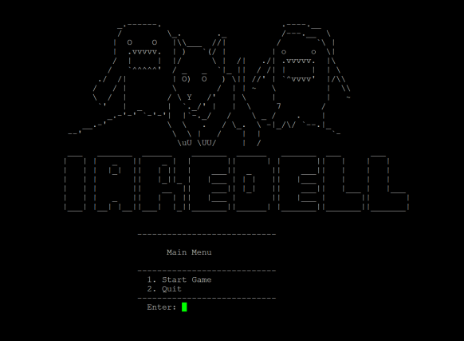
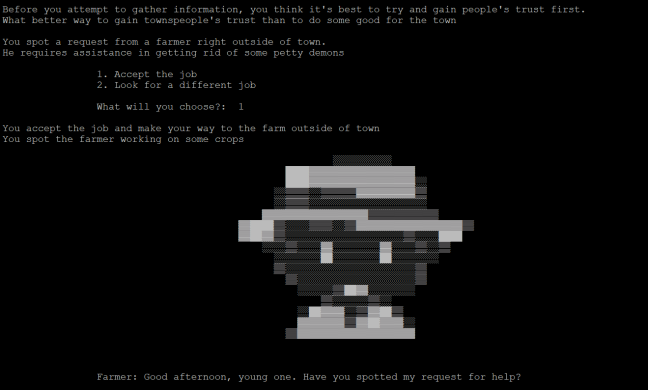
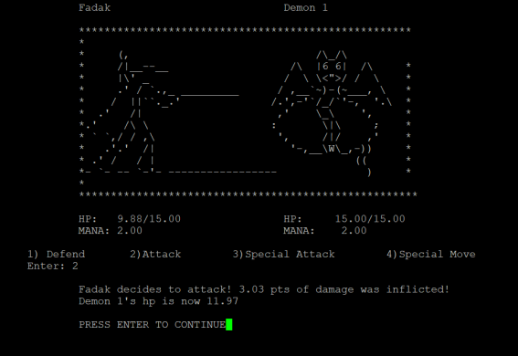
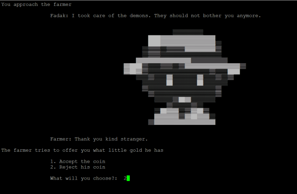
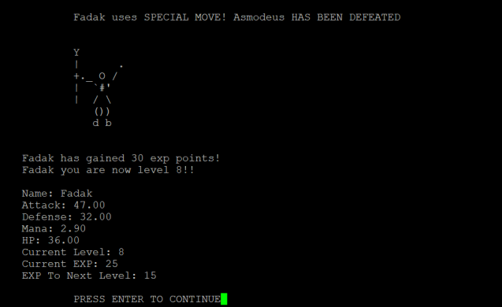
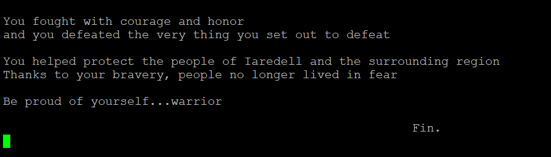

# Iaredell
 
 > Authors: [Nicole Carter (ncart018)](https://github.com/nicolec702), [Fadak Abdullah (@fabdu013)](https://github.com/faduckie), [Steven Truong (@struo025)](https://github.com/Steven-Eon), [Victor Sandoval (@vsand012)](https://github.com/VMSandoval25)

## Project Description
> **Project Importance:**
> We found the Text-Based RPG game to be the most creatively liberating out of the list of projects. We still had a guideline of what we needed to do, but we also have  infinite possibilities to expand on the project.
>
> Language: C++
> 
> **Features:**
> - A Storyline.
> - Dialogue System.
>   - Plan on using dialogue tree
> - XP Scaling System
>   - Later quests/enemies give you more xp
>   - They also deal more damage/have more health
> - Four distinct characters the player can choose from
>   - Four different classes + weapons 
> - Healing items (can sometimes randomly appear)
> - Leveling System
>   - Gain xp through:
>     - Killing enemies
>     - Completing quests
>   - Every time you level up your health/damage dealt is increased

## Class Diagrams
> 
> 
> 
>The Character class has one subclass (AttackCharacter), and AttackCharacter has two subclasses (NPAttackCharacter and PlayableCharacter). The AttackCharacter class tracks the players' stats/attributes in order to perform specific attack moves, as well as output the vitals and attributes of the player to the screen. The Attribute class has one subclass (AttributeBehavior). The purpose of the Attribute class is to keep track of the AttackCharacter’s hp, defense level, attack level, and stamina level. This is done in an effort to maintain modularity and keep the classes clean. AttackCharacter will also initiate an object of type Weapons. There will be an aggregation link between both classes. The Weapons class will make use of the strategy WeaponBehavior. WeaponsBehavior will declare an interface that all supported algorithms will use. These algorithms include LongSword, Staff, Daggers, Broom, and Basic. The Game class reads from files to output the storyline, choice prompts, and initiates the battle sequences.

## Design Patterns
> **Strategy Pattern**
> - For our weapons class we decided to use the strategy pattern because we realized that the weapons the player characters will be using are all the same object with similar member variables, the only difference is how much damage each weapon deals. Instead of creating five different classes for each weapon, we could create one class that has five different ‘strategies’ that could be swapped out depending on which weapon the player character is using. These strategies refer to the weapon behavior so we have a long sword strategy, a staff strategy, a dagger strategy, etc. This helps with minimizing unnecessary and redundant code and allows us to add more weapon strategies if we need to without any problems.
>
> **Abstract Factory Pattern**
> - For our Game class, we noticed that some of our implementations were not compatible when jumping from one operating system to the other. This is critical as platform compatibility is necessary; we would want the program to run regardless of which operating system one is running on. This issue with platform dependency has led us to choose an Abstract Factory Design Pattern so that the program can detect the operating system in use and act accordingly by instantiating the associated objects vital to run the program.

 
## Final deliverable

## Screenshots
> 
> 
> 
> 
> 
> 
> 

## Installation/Usage
> Method 1: Zip File
> - Download ZIP file onto local device
> - Extract contents
> - Open command terminal
> - Run 'cd' to the file path you extracted your contents to
> - Run 'g++ -o iaredell.exe main.cpp' to compile
> - Run iaredell.exe file

> Method 2: Terminal
> - Clone repository to hammer
> - Run 'cd' to repository
> - Run 'cmake3 .'
> - Run 'make'
> - Run './main'

## Testing
> The project was tested by creating unit tests with the gtest submodule, and valgrind for memory leak checks.

